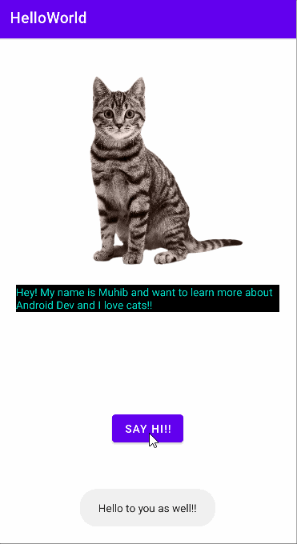

# Android Prework - *Hello World Android App*

Submitted by: **Muhib Sheikh**

**Hello World Android App** is an android app that shows an image and introductory message, and allows pressing a button to display a Toast. 

Time spent: **3** hours spent in total

## Required Features

The following **required** functionality is completed:

* [X] Image and introductory message displayed on screen
* [X] Button displayed on screen
* [X] Toast with message appears when button is pressed 

The following **optional** features are implemented:

* [ ] List anything else that you can get done to improve the app functionality!

## Video Walkthrough

Here's a walkthrough of implemented features:

<!-- Replace this with whatever GIF tool you used! -->
GIF created with [LiceCap](http://www.cockos.com/licecap/).  
<!-- Other options include:
[Kap](https://getkap.co/) for macOS
[ScreenToGif](https://www.screentogif.com/) for Windows
[peek](https://github.com/phw/peek) for Linux. -->

## Notes

Some challenges I faced included:
* Installing Android Studio - my file location was wrong but I was able to fix it 
* Getting the emulate setup right - it was opening in the toolbar and I wanted it to popout, looked it up and it was a checkbox in settings
* Connecting my GitHub account to Android Studio - did some research and ended up generating a token to use for login
* getting the correct .gitignore and merging master into main - realized there was a merge conflict so I resolved that then I was able to merge successfully
Describe any challenges encountered while building the app.

## License

    Copyright [2022] [Muhib Sheikh]

    Licensed under the Apache License, Version 2.0 (the "License");
    you may not use this file except in compliance with the License.
    You may obtain a copy of the License at

        http://www.apache.org/licenses/LICENSE-2.0

    Unless required by applicable law or agreed to in writing, software
    distributed under the License is distributed on an "AS IS" BASIS,
    WITHOUT WARRANTIES OR CONDITIONS OF ANY KIND, either express or implied.
    See the License for the specific language governing permissions and
    limitations under the License.
